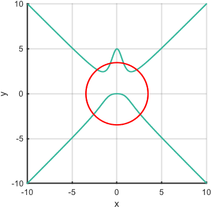
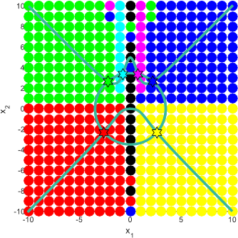

# Lygčių sistemų sprendimas ir optimizavimas
## 1 Tiesinių lygčių sistemų sprendimas
- Lentelėje 1 duotos tiesinės lygčių sistemos, 2 lentelėje nurodyti metodai ir lygčių sistemų numeriai (iš 1 lentelės). Reikia suprogramuoti nurodytus metodus ir jais išspręsti pateiktas lygčių sistemas.
- Lentelėje 3 duotos tiesinės lygčių sistemos, laisvųjų narių vektoriai ir nurodytas skaidos metodas. Reikia suprogramuoti nurodytą metodą ir juo išspręsti pateiktas lygčių sistemas.

Sprendžiant lygčių sistemas (a ir b punktuose), turi būti:
- Programoje turi būti įvertinti atvejai:
    - kai lygčių sistema turi vieną sprendinį;
    - kai lygčių sistema sprendinių neturi;
    - kai lygčių sistema turi be galo daug sprendinių.
- Patikrinkite gautus sprendinius ir skaidas, įrašydami juos į pradinę lygčių sistemą.
- Gautą sprendinį patikrinkite naudodami išorinius išteklius (pvz., standartines Python funkcijas).

## 2 Netiesinių lygčių sistemų sprendimas
Duota netiesinių lygčių sistema (4 lentelė):

$$ \begin{cases} Z_1(x_1, x_2) = 0 \\ Z_2(x_1, x_2) = 0 \end{cases} $$

- Skirtinguose grafikuose pavaizduokite paviršius $Z_1(x_1, x_2)$ ir $Z_2(x_1, x_2)$.
- Užduotyje pateiktą netiesinių lygčių sistemą išspręskite grafiniu būdu.
- Nagrinėjamoje srityje sudarykite stačiakampį tinklelį ($x_1$, $x_2$ poras). Naudodami užduotyje nurodytą metodą apskaičiuokite netiesinių lygčių sistemos sprendinius, kai pradinis artinys įgyja tinklelio koordinačių reikšmes. Tinklelyje vienodai pažymėkite taškus, kuriuos naudojant kaip pradinius artinius gaunamas tas pats sprendinys. Lentelėje pateikite apskaičiuotus skirtingus sistemos sprendinius ir bent po vieną jam atitinkantį pradinį artinį.
- Gautus sprendinius patikrinkite naudodami išorinius išteklius (pvz., standartines Python funkcijas).

## 3 Optimizavimas
Pagal pateiktą uždavinio sąlygą (5 lentelė) sudarykite tikslo funkciją ir išspręskite jį vienu iš gradientinių metodų (gradientiniu, greičiausio nusileidimo). Guatą taškų konfigūraciją pavaizduokite programoje, skirtingais ženklais pavaizduokite duotus ir pridėtus (jei sąlygoje tokių yra) taškus. Ataskaitoje pateikite pradinę ir gautą taškų konfigūracijas, taikytos tikslo funkcijos aprašymą, taikyto metodo pavadinimą ir parametrus, iteracijų skaičių, iteracijų pabaigos sąlygas ir tikslo funkcijos priklausomybės nuo iteracijų skaičiaus grafiką.

## 1 lentelė. Lygčių sistemos.
Nr: 10

$$\begin{cases} 9x_1 + 3x_2 - x_3 + 2x_4 = 65 \\ 3x_1 + 11x_2 - 2x_3 - 2x_4 = 27 \\ -x_1 - 2x_2 + 6x_3 - x_4 = -23 \\ 2x_1 -2x_2 - x_3 + 9x_4 = 39 \end{cases}$$

Nr: 11

$$\begin{cases} 2x_1 + 5x_2 + x_3 + 2x_4 = 14 \\ -2x_1 + 3x_3 + 5x_4 = 10 \\ x_1 - x_3 + x_4 = 4 \\ 5x_2 + 4x_3 + 7x_4 = 24 \end{cases}$$

Nr: 17

$$\begin{cases} 2x_1 + 5x_2 + x_3 + 2x_4 = -1 \\ -2x_1 + 3x_3 + 5x_4 = 7 \\ x_1 - x_3 + x_4 = 3 \\ 5x_2 + 4x_3 + 7x_4 = 4 \end{cases}$$

## 2 lentelė. Tiesinių lygčių sistemų metodai ir lygčių sistemų Nr.
<table>
    <thead>
        <tr>
            <th>Užduoties Nr.</th>
            <th>Metodas</th>
            <th>Lygčių sistemos Nr. (1 lentelė)</th>
        </tr>
    <thead>
    <tbody>
        <tr>
            <td rowspan=2>1</td>
            <td>Gauso</td>
            <td>10, 11, 17</td>
        </tr>
        <tr>
            <td>Paprastųjų iteracijų</td>
            <td>10</td>
        </tr>
        <tr>
            <td rowspan=2>2</td>
            <td>Gauso</td>
            <td>9, 15, 18</td>
        </tr>
        <tr>
            <td>Gauso-Zeidelio</td>
            <td>9</td>
        </tr>
        <tr>
            <td rowspan=2>3</td>
            <td>Atspindžio</td>
            <td>7, 15, 16</td>
        </tr>
        <tr>
            <td>Paprastųjų iteracijų</td>
            <td>7</td>
        </tr>
        <tr>
            <td rowspan=2>4</td>
            <td>Atspindžio</td>
            <td>3, 12, 19</td>
        </tr>
        <tr>
            <td>Gauso-Zeidelio</td>
            <td>3</td>
        </tr>
        <tr>
            <td rowspan=2>5</td>
            <td>Gauso</td>
            <td>2, 12, 17</td>
        </tr>
        <tr>
            <td>Paprastųjų iteracijų</td>
            <td>2</td>
        </tr>
        <tr>
            <td rowspan=2>6</td>
            <td>Gauso</td>
            <td>6, 15, 18</td>
        </tr>
        <tr>
            <td>Gauso-Zeidelio</td>
            <td>6</td>
        </tr>
        <tr>
            <td rowspan=2>7</td>
            <td>Atspindžio</td>
            <td>4, 14, 16</td>
        </tr>
        <tr>
            <td>Paprastųjų iteracijų</td>
            <td>4</td>
        </tr>
        <tr>
            <td rowspan=2>8</td>
            <td>Atspindžio</td>
            <td>1, 14, 20</td>
        </tr>
        <tr>
            <td>Gauso-Zeidelio</td>
            <td>1</td>
        </tr>
        <tr>
            <td rowspan=2>9</td>
            <td>Gauso</td>
            <td>5, 13, 19</td>
        </tr>
        <tr>
            <td>Gauso-Zeidelio</td>
            <td>5</td>
        </tr>
        <tr>
            <td rowspan=2>10</td>
            <td>Atspindžio</td>
            <td>8, 13, 20</td>
        </tr>
        <tr>
            <td>Paprastųjų iteracijų</td>
            <td>8</td>
        </tr>
    </tbody>
</table>

## 3 lentelė. Tiesinių lygčių sistemos ir laisvųjų narių stulpeliai.
Nr: 1
Lygčių sistema:
$\begin{cases} 2x_1+5x_2+x_3+2x_4=... \\ -2x_1+3x_3+5x_4=... \\ x_1-x_3+x_4=... \\ -3x_1-4x_2+x_3+x_4=... \end{cases}$
B1:
$\begin{cases} ...=10 \\ ...=6 \\ ...=1 \\ ...=-5 \end{cases}$
B2:
$\begin{cases} ...=74 \\ ...=28 \\ ...=18 \\ ...=-48 \end{cases}$
B3:
$\begin{cases} ...=-0.25 \\ ...=-1 \\ ...=0.5 \\ ...=-0.5 \end{cases}$
Metodas: QR

## 4 lentelė. Netiesinių lygčių sistemų sprendimas. Užduotys.
Nr: 1
Lygčių sistema:
$\begin{cases} \frac{10x_1}{x^2_2+1}+x^2_1-x^2_2=0 \\ x^2_1+2x^2_2-32=0  \end{cases}$ 
Metodas: Niutono

**Pavyzdys**

Lygčių sistema: $\begin{cases} -\frac{5x_2}{x^2_1+1}+x^2_2-x^2_1=0 \\ x^2_1+x^2_2-12=0 \end{cases}$ 
| Grafinis sprendinys | Pradinių artinių tinklelis |
| --- | --- |
| |  |  |

## 5 lentelė. Optimizavimo uždaviniai.
| * rekomenduojama $n<=20$, $m<=20$ |
| --- |
| Uždavinys 1-3 variantams |
| Miestas išsidėstęs kvadrate, kurio koordinatės $(−10<=x<=10, −10<=y<=10)$. Mieste yra n $(n>=3)$ vieno tinklo parduotuvių, kurių koordinatės yra žinomos (Koordinatės gali būti generuojamos atsitiktinai, negali būti kelios parduotuvės toje pačioje vietoje). Planuojama pastatyti dar m $(m>=3)$ šio tinklo parduotuvių. Parduotuvės pastatymo kaina (vietos netinkamumas) vertinama pagal atstumus iki kitų parduotuvių ir miesto ribos. Reikia parinkti naujų parduotuvių vietas (koordinates) taip, kad parduotuvių pastatymo kainų suma būtų kuo mažesnė. Atstumo tarp dviejų parduotuvių, kurių koordinatės $(x_1, y_1)$ ir $(x_2, y_2)$, kaina apskaičiuojama pagal formulę:   $𝐶(x_1, y_1, x_2, y_2) = exp(−0.2 * ((x_1 − x_2)^2 + (y_1 − y_2)^2))$   Atstumo tarp parduotuvės, kurios koordinatės $(x_1, y_1)$, ir artimiausio miesto ribos taško, kurio koordinatės $(x_r, y_r)$, kaina apskaičiuojama pagal formulę:   $C^R(x_1, y_1, x_r, y_r) = \begin{cases} 0,\;jeigu\;parduotuvę\;planuojama\;statyti\;miesto\;ribose \\ exp(0.25 * ((x_1 − x_r)^2 + (y_1 − y_r)^2)) − 1, kitais\;atvejais \end{cases}$ |