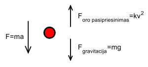

# ?? PAVADINIMAS ??

## Bendroji sąlyga

1. Žemiau pateikti uždaviniai paprastųjų diferencialinių lygčių sistemų sprendimui. Remdamiesi tame pačiame faile pateiktų fizikinių dėsnių aprašymais, nurodytam variantui sudarykite diferencialinę lygtį arba lygčių sistemą. Lygties ar lygčių sistemos sudarymą paaiškinkite ataskaitoje.
2. Diferencialinę lygtį (arba lygčių sistemą) išspręskite **Eulerio ir IV eilės Rungės ir Kutos metodais**.
3. Keisdami metodo žingsnį įsitikinkite, kad gavote tikslų sprendinį. Atsakykite į uždavinyje pateiktus klausimus. Tuo pačiu metodu naudojant skirtingus žingsnius gautus sprendinius pavaizduokite viename grafike. Palyginkite metodus tikslumo prasme.
4. Keisdami metodo žingsnį nustatykite didžiausią žingsnį, su kuriuo metodas išlieka stabilus. Tuo pačiu metodu naudojant skirtingus žingsnius gautus sprendinius pavaizduokite viename grafike. Palyginkite stabilumo prasme.
5. Patikrinkite gautą sprendinį su MATLAB standartinė funkcija `ode45`. Python `scipy.integrate` bibliotekos funkcija `solve_ivp` ar kitais išoriniais šaltiniais. Tame pačiame grafike turi būti pateikti realizacijose ir naudojant išorinius šaltinius gauti sprendiniai.

## Niutono dinamikos dėsniai

Judančio kūno metamatiniame modelyje taikomi Niutono dėsniai.

Pirmasis Niutono dėsnis teigia, kad egzistuoja tokios ataskaitos sistemos, kurių atžvilgiu kūnai juda tiesiai ir tolygiai arba yra rimties būsenoje, kai jų neveikia kiti kūnai (kai kūną veikiančių jėgų suma lygi nuliui).

Antrasis Niutono dėsnis teigia, kad pagreitis $\overrightarrow{a}$, kuriuo juda kūnas yra tiesiogiai proporcingas kūną veikiančiai jėgai $\overrightarrow{F}$ ir atvirkščiai proporcingas to kūno masei $m$.

$$\overrightarrow{F}=m\overrightarrow{a}$$

Žinome, kad greitis yra pirmoji kelio funkcijos $s(t)$ išvestinė, o pagreitis - pirmoji greičio funkcijos $v(t)$ išvestinė (antroji kelio funkcijos $s(t)$ išvestinė), t.y. $\frac{ds}{dt}=v,\frac{d^2s}{dt^2}=\frac{dv}{dt}=a$.

Uždaviniuose naudokite laisvojo kritimo pagreitį $g=9,8m/s^2$.

## Uždavinio pavyzdys

$m_1$ kg masės parašiutininkas iššoka iš lėktuvo (įrangos masė nevertinama). Pasiekęs $h_0$ m aukštį parašiutininkas išskleidžia parašiutą. Tuo metu jo greitis lygus $v_0$ m/s. Oro pasipriešinimo jėga proporcinga greičio kvadratui, o proporcingumo koeficientas lygus $k$ kg/m. Raskite, kaip kinta parašiutininko greitis. 

Remiantis Niutono dėsniai sudaroma lygtis:
$$F=F_{gravitacija}-F_{oro \space pasipriesinimas}$$
Po pertvarkymų sprendžiama diferencialinė lygtis $\frac{dv}{dt}=\frac{mg-kv^2}{m}$

## Uždavinys variantams 1-10

Sujungti $m_1$ ir $m_2$ masių objektai iššaunami vertikaliai į viršų pradiniu greičiu $v_0$. Oro pasipriešinimo koeficientas sujungtiems kūnams lygus $k_s$. Praėjus laikui $t_s$, objektai pradeda judėti atskirai. Oro pasipriešinimo koeficientai atskirai judantiems objektams atitinkamai yra $k_1$ ir $k_2$. Oro pasipriešinimas proporcingas objekto greičio kvadratui. Raskite, kaip kinta objektų greičiai nuo 0s iki $t_{max}$. Kada kiekvienas objektas pasieks aukščiausią tašką ir pradės leistis?
| Varianto numeris | $m_1$, kg | $m_2$, kg | $v_0$, m/s | $k_s$, kg/m | $t_s$, s | $k_1$, kg/m | $k_2$, kg/m | $t_{max}$, s |
|---|---|---|---|---|---|---|---|---|
| 1 | 0.2 | 0,4 | 80 | 0,015 | 1 | 0,02 | 0,005 | 15 |
| 2 | 0,15 | 0,2 | 70 | 0,01 | 2 | 0,05 | 0,001 | 10 |
| 3 | 0,07 | 0,2 | 50 | 0,015 | 3 | 0,05 | 0,01 | 10 |
| 4 | 0,5 | 0,25 | 100 | 0,002 | 2 | 0,02 | 0,04 | 15 |
| 5 | 0,6 | 0,2 | 200 | 0,01 | 2 | 0,02 | 0,015 | 15 |
| 6 | 0,1 | 0,5 | 60 | 0,01 | 1 | 0,01 | 0,005 | 10 |
| 7 | 0,3 | 0,3 | 60 | 0,005 | 2 | 0,05 | 0,01 | 10 |
| 8 | 0,05 | 0,3 | 100 | 0,01 | 3 | 0,05 | 0,01 | 10 |
| 9 | 0,4 | 0,8 | 50 | 0,001 | 2 | 0,02 | 0,02 | 10 |
| 10 | 0,8 | 0,8 | 200 | 0,01 | 2 | 0,02 | 0,005 | 15 |